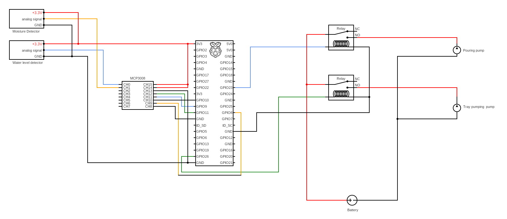

# AutoWaterPi
An auto machine that water your plant. with auto picture capture function.

# IT'S NOT WORKING NOW!
under developing

# Preconfiguration    

In `init.sh`.  
Variable `minute` determine the interval of water tray level and moisture check. Default is `5`  
Variable `cminute` determine the interval of picture captures. Default is `15`  

  
If relay module needs power supply, plug to 5V power pin.

# Installation    

Run `init.sh` as root, it will put `check.py` and `capture.py` into crontab.  
By this, it can check Water level on tray and soil moisture periodically.  
Also, it will install apache2, python3-pandas, python3-matplotlib automatically.  
You can watch the pictures captured at `Your IP/AutoWaterPi/Captured` after installation.  

# Configuration
You can still edit the interval of time after installation by command `crontab -u root -e`

### Pin of Miscellaneous
Pour pump: Defined in `water.py`, as variable `pin`.  
Tray pump: Defined in `pump.py`, as variable `pin`.  
Water tray level detector: Defined in `waterlevel.py`, as variable `channel`.  
Soil moisture detector: defined in `waterlevel.py`, as variable `channel`.  

### Editing the pouring value of water each time
In `water.py`, edit the time of sleep. Effects the time of pump's activation in seconds.

### Naming of pictures
Defined in `capture.py`, the `timestamp` variable.

# Removal  
The remove.sh can help you remove the schedules set while installation.
But apache2 won't be remove while uninstallation.
Run it as root.
